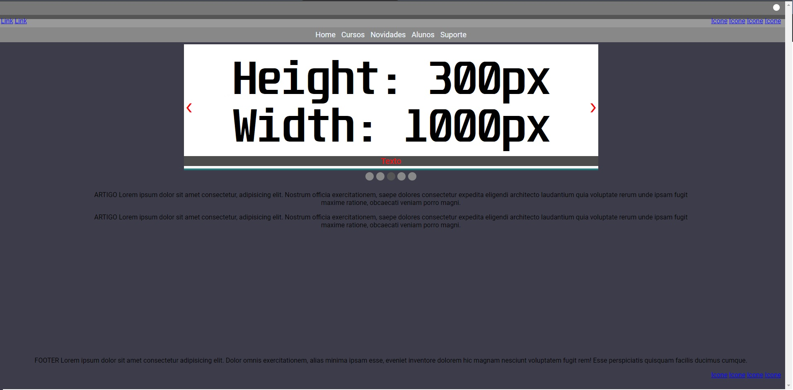

# Site Template
> Um template de site completo.

Site com login e registro modal,troca de tema com local storage que salva a escolha do tema,responsivo(ainda nao implementado).

## Histórico de lançamentos

* Construção
    * Trabalho em andamento

Distribuído sob a licença MIT. Veja `LICENSE.MD` para mais informações.

## Quer contribuir

1. Caso queira faça o _fork_ do projeto
2. Crie uma _branch_ para sua modificação 
3. Faça o _commit_
4. Faça o _Push_
5. Crie um novo _Pull Request_
